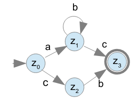

# haskell-automata

Haskell library for working with automata, converting DFAs to and simplifying Regular Expressions

## Example
Consider the automaton A = (Q, Σ, δ, q₀, F) where

>Q = {0, 1, 2, 3} \
Σ = {'a', 'b', 'c'} \
δ (0, 1) = 'a' \
δ (1, 1) = 'b' \
δ (1, 2) = 'c' \
δ (0, 2) = 'c' \
δ (2, 3) = 'b' \
q₀ = 0 \
F = {3}

\


With the type DFA being defined as

```haskell
data DFA = DFA
    { dfaTransitions :: [(State, State, AlphabetElement)]
    , dfaFinalStates :: [State]
    , dfaState :: State
    }
    deriving (Show, Eq)
```

automaton A can be represented as
```haskell
autom :: DFA
autom = 
    DFA 
        [ (0, 1, 'a')
        , (1, 1, 'b')
        , (1, 3, 'c')
        , (0, 2, 'c')
        , (2, 3, 'b')
        ]
        [3]
        0
```

which can then be converted to a regular expression

```haskell
regexify autom
> RegexOr (RegexConcat (RegexConcat (RegexString "a") (RegexAny (RegexString "b"))) (RegexString "c")) (RegexConcat (RegexString "c") (RegexString "b"))


stringify . regexify $ autom
> "(ab*c|cb)"
```

where the Regex type is defined as
```haskell
data Regex
    = RegexNull
    | RegexEmpty
    | RegexString String
    | RegexAny Regex
    | RegexSome Regex
    | RegexOptional Regex
    | RegexOr Regex Regex
    | RegexConcat Regex Regex
    deriving (Show, Eq)
``` 

\
Regexify works using the transitive closure method [^1] to convert DFAs to regular expressions.
To simplify the regular expressions, pattern matching on given rules is used to simplify the expression as far as possible.

**This will not always result in the shortest possible expression but it will definitely be an equivalent one.**

</br>
</br>

> Currently only DFAs are supported, which also means that δ has to be total, so there cannot be multiple transitions between two states.

[^1]: The transitive closure method is explained [here](https://cs.stackexchange.com/a/2395) in great detail